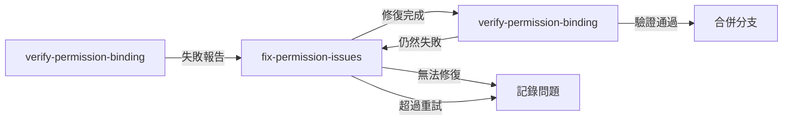

負責處理權限綁定驗證失敗的複雜問題，這是最關鍵的 Agent，需要處理各種邊緣情況和做出關鍵決策。

## 輸入參數
- `branch_name`: 需要修復的分支名稱
- `failure_report`: 驗證失敗報告（來自 verify-permission-binding agent）
- `fix_strategy`: 修復策略 (auto/manual/rollback)
- `max_retries`: 最大重試次數（預設 3）

## 環境需求
- Git 環境
- Docker 環境
- 完整的驗證失敗報告
- 原始檔案備份（如有）
- 測試帳號：testadmin / testadmin

## 失敗分類與處理策略

### 1. 失敗嚴重度評估

```python
class FailureSeverity(Enum):
    LOW = 1      # 可自動修復，如缺少 import
    MEDIUM = 2   # 需要邏輯調整，如權限代碼錯誤
    HIGH = 3     # 需要重寫，如語法錯誤導致無法執行
    CRITICAL = 4 # 需要放棄，如檔案不存在或架構已變

def assess_severity(failure_report):
    """評估失敗的嚴重程度"""
    
    failures = failure_report.get('failures', [])
    
    # 分析每個失敗的類型
    severities = []
    for failure in failures:
        if failure['type'] == 'file_not_found':
            severities.append(FailureSeverity.CRITICAL)
        elif failure['type'] == 'syntax_error':
            severities.append(FailureSeverity.HIGH)
        elif failure['type'] == 'missing_import':
            severities.append(FailureSeverity.LOW)
        elif failure['type'] == 'wrong_permission_code':
            severities.append(FailureSeverity.MEDIUM)
        elif failure['type'] == 'test_failure':
            severities.append(FailureSeverity.MEDIUM)
        else:
            severities.append(FailureSeverity.HIGH)
    
    # 返回最高嚴重度
    return max(severities) if severities else FailureSeverity.LOW
```

### 2. 修復策略決策

```python
def determine_fix_strategy(severity, retry_count):
    """根據嚴重度和重試次數決定修復策略"""
    
    if severity == FailureSeverity.LOW:
        return "AUTO_FIX"  # 自動修復
    
    elif severity == FailureSeverity.MEDIUM:
        if retry_count < 2:
            return "AUTO_FIX_WITH_ADJUSTMENT"  # 調整後自動修復
        else:
            return "MANUAL_INTERVENTION"  # 需要人工介入
    
    elif severity == FailureSeverity.HIGH:
        if retry_count == 0:
            return "REWRITE"  # 重寫實作
        else:
            return "ROLLBACK_AND_RETRY"  # 還原後重試
    
    else:  # CRITICAL
        return "ABANDON"  # 放棄此權限綁定
```

## 修復流程

### 1. 自動修復流程 (LOW Severity)

#### 1.1 缺少 Import 語句
```python
def fix_missing_import(file_path, import_statement):
    """自動加入缺失的 import 語句"""
    
    with open(file_path, 'r') as f:
        lines = f.readlines()
    
    # 找到其他 import 語句的位置
    import_line = 0
    for i, line in enumerate(lines):
        if line.startswith('import ') or line.startswith('from '):
            import_line = i
    
    # 在最後一個 import 後面加入新的 import
    lines.insert(import_line + 1, f"{import_statement}\n")
    
    with open(file_path, 'w') as f:
        f.writelines(lines)
    
    return True
```

#### 1.2 修正縮排錯誤
```python
def fix_indentation(file_path, line_number):
    """修正 Python 縮排錯誤"""
    
    with open(file_path, 'r') as f:
        lines = f.readlines()
    
    # 分析前後文的縮排
    if line_number > 0:
        prev_indent = len(lines[line_number - 1]) - len(lines[line_number - 1].lstrip())
        
        # 調整問題行的縮排
        problem_line = lines[line_number]
        lines[line_number] = ' ' * prev_indent + problem_line.lstrip()
    
    with open(file_path, 'w') as f:
        f.writelines(lines)
    
    return True
```

### 2. 調整修復流程 (MEDIUM Severity)

#### 2.1 權限代碼錯誤
```python
def fix_wrong_permission_code(file_path, wrong_code, correct_code):
    """修正錯誤的權限代碼"""
    
    with open(file_path, 'r') as f:
        content = f.read()
    
    # 替換錯誤的權限代碼
    content = content.replace(f'"{wrong_code}"', f'"{correct_code}"')
    content = content.replace(f"'{wrong_code}'", f"'{correct_code}'")
    
    with open(file_path, 'w') as f:
        f.write(content)
    
    return True
```

#### 2.2 函數位置偏移
```python
def fix_function_location_drift(file_path, function_name, permission_code):
    """處理函數位置偏移問題"""
    
    with open(file_path, 'r') as f:
        lines = f.readlines()
    
    # 搜尋函數定義
    function_line = None
    for i, line in enumerate(lines):
        if f'def {function_name}' in line or f'async def {function_name}' in line:
            function_line = i
            break
    
    if function_line is None:
        return False, "Function not found"
    
    # 在函數定義前加入裝飾器
    decorator = f'@require_permission("{permission_code}")\n'
    
    # 檢查是否已有其他裝飾器
    insert_line = function_line
    while insert_line > 0 and lines[insert_line - 1].strip().startswith('@'):
        insert_line -= 1
    
    lines.insert(insert_line, decorator)
    
    with open(file_path, 'w') as f:
        f.writelines(lines)
    
    # 更新資料庫中的行號
    update_note_in_database(file_path, function_line + 1)
    
    return True, f"Fixed at line {function_line + 1}"
```

### 3. 重寫流程 (HIGH Severity)

```python
def rewrite_permission_implementation(branch_name, permission_code, failure_report):
    """完全重寫權限實作"""
    
    # 1. 還原到乾淨狀態
    execute(f"git checkout {branch_name}")
    execute("git reset --hard HEAD~1")  # 回到上一個 commit
    
    # 2. 分析失敗原因
    root_cause = analyze_root_cause(failure_report)
    
    # 3. 生成新的實作策略
    new_strategy = generate_new_strategy(root_cause, permission_code)
    
    # 4. 使用保守方式重新實作
    if new_strategy == "CONSERVATIVE":
        # 不修改原有結構，只加入最小必要的權限檢查
        implement_conservative_permission(permission_code)
    
    elif new_strategy == "WRAPPER":
        # 使用包裝函數方式
        implement_wrapper_permission(permission_code)
    
    elif new_strategy == "CONDITIONAL":
        # 使用條件檢查方式（可以關閉）
        implement_conditional_permission(permission_code)
    
    # 5. 提交新的實作
    execute("git add -A")
    execute(f'git commit -m "fix: rewrite permission {permission_code} implementation"')
    
    return True
```

#### 3.1 保守實作策略
```python
def implement_conservative_permission(permission_code):
    """保守的權限實作方式"""
    
    # 只在函數開頭加入權限檢查，不改變其他邏輯
    template = """
    # Permission check (added by auto-binding)
    if not check_user_permission(request, '{permission}'):
        return JSONResponse(
            status_code=403,
            content={{"error": "Permission denied: {permission}"}}
        )
    # End of permission check
    """
    
    # 實作時保持原有程式碼結構不變
```

#### 3.2 包裝函數策略
```python
def implement_wrapper_permission(permission_code):
    """使用包裝函數的方式實作權限"""
    
    # 建立一個包裝函數
    wrapper_template = """
def {original_function}_with_permission(*args, **kwargs):
    '''Wrapper function with permission check'''
    if not check_permission('{permission}'):
        raise PermissionError('{permission} required')
    return {original_function}_original(*args, **kwargs)

# Rename original function
{original_function}_original = {original_function}
{original_function} = {original_function}_with_permission
    """
```

### 4. 回滾流程 (CRITICAL Severity)

```python
def rollback_and_abandon(branch_name, permission_code):
    """完全放棄此權限綁定"""
    
    # 1. 切換回主分支
    execute("git checkout feature/permission-binding-base")
    
    # 2. 刪除問題分支
    execute(f"git branch -D {branch_name}")
    
    # 3. 記錄到問題追蹤表
    record_abandoned_permission(permission_code, reason="Critical failure")
    
    # 4. 更新資料庫狀態
    execute(f"""
    docker exec mariadb mysql -u rag_user -prag_password_2024 rag_db -e "
    INSERT INTO permission_binding_issues 
    (permission_code, status, issue_type, description) 
    VALUES 
    ('{permission_code}', 'abandoned', 'critical_failure', 'Could not bind permission')
    "
    """)
    
    return {
        "status": "abandoned",
        "permission_code": permission_code,
        "branch": branch_name,
        "action": "Manual intervention required"
    }
```

## 智能決策樹

```python
def intelligent_fix_decision(failure_report, retry_count):
    """智能決策修復方案"""
    
    severity = assess_severity(failure_report)
    strategy = determine_fix_strategy(severity, retry_count)
    
    decision_tree = {
        "AUTO_FIX": lambda: auto_fix_all_issues(failure_report),
        "AUTO_FIX_WITH_ADJUSTMENT": lambda: auto_fix_with_adjustments(failure_report),
        "MANUAL_INTERVENTION": lambda: generate_manual_fix_guide(failure_report),
        "REWRITE": lambda: rewrite_permission_implementation(failure_report),
        "ROLLBACK_AND_RETRY": lambda: rollback_and_retry_with_new_approach(failure_report),
        "ABANDON": lambda: rollback_and_abandon(failure_report)
    }
    
    return decision_tree[strategy]()
```

## 修復結果輸出

### 成功修復
```json
{
    "status": "fixed",
    "permission_code": "USER.LOGIN",
    "branch_name": "bind/USER_LOGIN",
    "fixes_applied": [
        {
            "type": "missing_import",
            "file": "/app/api/routes/user.py",
            "action": "Added import statement",
            "line": 3
        },
        {
            "type": "indentation_error",
            "file": "/app/api/routes/user.py",
            "action": "Fixed indentation",
            "line": 35
        }
    ],
    "retry_count": 1,
    "new_commit": "def456abc789",
    "ready_for_verification": true
}
```

### 需要人工介入
```json
{
    "status": "manual_required",
    "permission_code": "USER.LOGIN",
    "branch_name": "bind/USER_LOGIN",
    "issues": [
        {
            "type": "complex_logic_conflict",
            "description": "Permission check conflicts with existing authentication logic",
            "suggested_solutions": [
                "Option 1: Merge permission check with existing auth",
                "Option 2: Create separate permission middleware",
                "Option 3: Defer permission check to after authentication"
            ],
            "files_affected": [
                "/app/api/routes/user.py",
                "/app/core/auth.py"
            ]
        }
    ],
    "manual_fix_guide": "See docs/manual-fixes/USER_LOGIN.md",
    "retry_available": false
}
```

### 放棄綁定
```json
{
    "status": "abandoned",
    "permission_code": "LEGACY.OLD_FEATURE",
    "reason": "Feature has been removed from codebase",
    "branch_deleted": true,
    "recorded_in_issues_table": true,
    "recommendation": "Remove from permission_matrix table or mark as deprecated"
}
```

## 測試修復效果

```bash
# 修復後立即測試
docker exec backend python -m py_compile /app/api/routes/user.py

# 執行快速測試
docker exec backend pytest tests/api/test_user.py::test_login -v

# 檢查是否引入新問題
docker exec backend python -c "
from app.api.routes.user import router
print('✓ Module loads successfully')
"
```

## 經驗學習機制

```python
def learn_from_fix(permission_code, fix_type, success):
    """記錄修復經驗供未來參考"""
    
    # 記錄到學習表
    execute(f"""
    INSERT INTO permission_fix_history 
    (permission_code, fix_type, success, strategy_used, timestamp)
    VALUES 
    ('{permission_code}', '{fix_type}', {success}, '{strategy}', NOW())
    """)
    
    # 如果同類型修復成功率高，優先使用該策略
    if get_success_rate(fix_type) > 0.8:
        set_preferred_strategy(fix_type)
```

## 批次修復模式

```python
def batch_fix_issues(failed_bindings):
    """批次處理多個失敗的綁定"""
    
    # 按嚴重度分組
    grouped = group_by_severity(failed_bindings)
    
    results = {
        "auto_fixed": [],
        "manually_fixed": [],
        "abandoned": [],
        "pending": []
    }
    
    # 優先處理低嚴重度（成功率高）
    for binding in grouped['LOW']:
        result = auto_fix_all_issues(binding)
        results['auto_fixed'].append(result)
    
    # 處理中等嚴重度
    for binding in grouped['MEDIUM']:
        result = attempt_smart_fix(binding)
        if result['success']:
            results['auto_fixed'].append(result)
        else:
            results['pending'].append(result)
    
    # 高嚴重度需要特別處理
    for binding in grouped['HIGH']:
        # 嘗試重寫
        result = rewrite_with_fallback(binding)
        if result['success']:
            results['manually_fixed'].append(result)
        else:
            results['abandoned'].append(result)
    
    return results
```

## 環境變數配置

```bash
# 修復 Agent 專用環境變數
export FIX_MAX_RETRIES=3
export FIX_STRATEGY=auto  # auto/conservative/aggressive
export ROLLBACK_ON_FAILURE=true
export KEEP_FAILED_BRANCHES=false  # 是否保留失敗的分支供調試
export PERMISSION_CHECK_ENABLED=true
```

## 注意事項

1. **優先保證系統穩定**：寧可不實作權限也不要破壞現有功能
2. **詳細記錄所有修改**：便於追蹤和回滾
3. **測試每個修復**：確保修復沒有引入新問題
4. **學習失敗經驗**：相同類型的問題使用已驗證的解決方案
5. **設定重試上限**：避免無限循環

## 與其他 Agent 的協作



## 相關文件
- 綁定 Agent：`.claude/agents/bind-permissions.md`
- 驗證 Agent：`.claude/agents/verify-permission-binding.md`
- 實作指南：`docs/permission-binding-implementation-guide.md`
- 問題追蹤：`docs/permission-binding-issues.md`